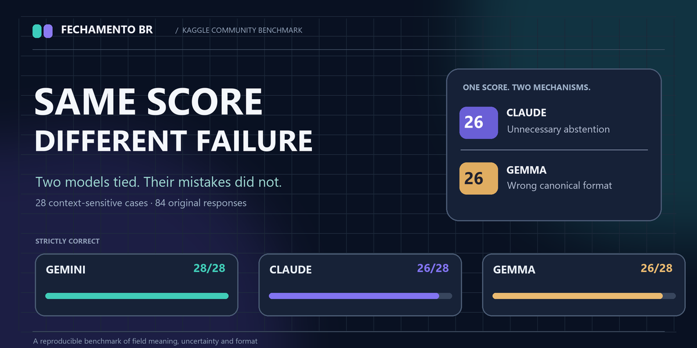

# Fechamento BR — Same Score, Different Failure

**Kaggle Community Benchmarking Challenge (2026).** A focused, reproducible study of context-sensitive field normalization: numbers, ambiguous formats, missing versus explicit zero, dates and opaque identifiers.

## Explore

**[Interactive evidence explorer](https://lawliet8886.github.io/fechamento-br-benchmark/)** — examine all 28 fictional cases, their gold labels, and **84 original unedited responses**, including the paired examples behind the main finding.

**[Published DEV challenge entry](https://dev.to/lawliet8886/same-score-different-failure-fechamento-br-1050)** — research question, methods, results, caveats and analysis.

**[Public Kaggle benchmark](https://www.kaggle.com/benchmarks/lawliet8886/fechamento-br-same-score-different-failure)** — official Kaggle Task/collection.

## Frozen original study

| Model | Strict correct | Complete contrast pairs |
| --- | ---: | ---: |
| Gemini 3.8 Flash | 28/28 | 12/12 |
| Claude Sonnet 4.6 | 26/28 | 11/12 |
| Gemma 4 26B A4B | 26/28 | 11/12 |

**Same total, different failure.** In two locale-explicit money cases, Claude unnecessarily abstained; Gemma produced the correct numerical magnitude but violated the required two-decimal-place representation. No cases were changed after inspecting these results. The exact canonical-output format is part of the evaluation contract.

These are 28 authored questions and a single recorded evaluation per model. This does **not** prove general reliability, statistical significance or one model's superiority in production.

## Independently regrade the saved results — no account, API, or cost

Use Python 3.10 or newer:

~~~bash
cd research
python verify_results.py
~~~

This verifies the frozen file hashes, all **84 original responses**, model/run consistency and aggregate scores. It makes **zero model calls** and needs **no packages, network access or API keys**.

The [research/](research/) directory is an unchanged historical reproducibility package. Its README and ARTICLE_DRAFT were prepared before the article was published; those originals deliberately remain unchanged so their SHA-256 checks remain meaningful. The definitive published article is linked above.

## Interactive explorer

The self-contained static page lives in [docs/index.html](docs/index.html). It supports a case search, family filters, contrast-pair navigation and side-by-side reading of every original response. [docs/evidence.json](docs/evidence.json) includes only fictional test material and responses.

No user tracking, analytics, subscriptions, inference API, or paid resources.

**Important:** The later Kaggle public leaderboard reruns are **separate** from the original 84-response study. This repository does not invent scores for any failed public rerun.
